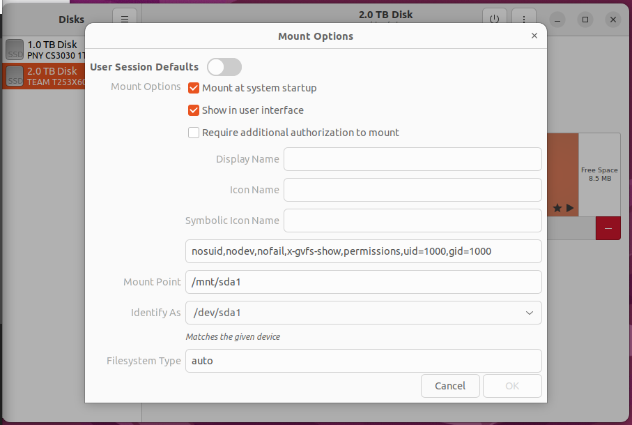

# docker-server
for setup of plex and deluge

## additional setup
1. follow all setup instructions for docker-desktop here: https://docs.docker.com/desktop/install/ubuntu/

2. ensure docker desktop is enabled for autorun with 
`systemctl --user enable docker-desktop`

3. make sure all mounted drives are mounted correctly. note `permissions` and `uid`, `gid` options. Also make sure you mount on startup

4. add drives to the file sharing resource in docker-desktop

5. update the paths and claim id in the `.env` file

6. start the docker containers with `docker compose up -d`

## troubleshooting
Some drive formats do not work with POSIX permissions. exFat being one of them. In this case, to perserve compatibility with windows, I formatted the external drive to NTFS.